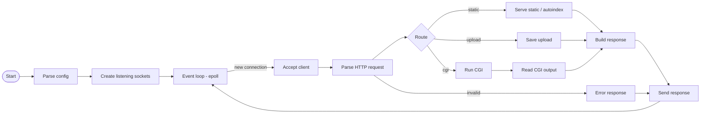

# Webserv — An HTTP/1.1 Server in C++98

This project is a high-performance, event-driven HTTP server built from scratch. It is a deep dive into the fundamentals of network programming, implementing the core components of the HTTP/1.1 protocol using non-blocking I/O, a flexible configuration system, and a robust CGI handler for dynamic content.

The entire server is written in C++98, adhering to the strict project guidelines of the 42 curriculum, without the use of modern libraries for networking or HTTP handling.

---

## ⚙️ Core Concepts & Technologies

This server is built on three foundational pillars of network programming. Understanding them is key to understanding the project.

### 1. Non-Blocking I/O with epoll

* **What is it?**
  Instead of getting stuck waiting for one client to send data, the server uses epoll to monitor hundreds of connections at once. The operating system efficiently tells us exactly which clients are ready for reading or writing.

* **Why does it matter?**
  This model allows the server to handle a high number of concurrent connections with a single thread, making it incredibly lightweight and scalable. It's the same principle used by modern servers like Nginx.

### 2. HTTP Request/Response Cycle

The server implements the core logic of HTTP/1.1.

* It features a robust, state-machine-based parser for incoming requests, capable of handling the request line, headers, and body.
* It constructs and sends back well-formed HTTP responses, with correct status codes and headers like `Content-Type` and `Content-Length`.

### 3. CGI (Common Gateway Interface)

To serve dynamic content, the server implements the CGI/1.1 standard.

* **What is it?**
  CGI is a protocol that allows the web server to execute an external script (like PHP or Python) to generate a response, instead of just serving a static file.

* **How it works:**
  The server uses `fork()` to create a new process and `pipe()` to create communication channels. It uses `dup2()` to redirect the script's stdin and stdout to these pipes, and finally `execve()` to run the script. All request information is passed to the script via environment variables. This allows the C++ server to act as a secure gateway to powerful scripting languages.

---

## 🏗️ Architectural Canvas

---

## ✨ Features Implemented

* **HTTP Methods:** GET, POST, DELETE
* **Configuration:** Nginx-inspired config parsing (server blocks, locations)
* **Virtual Hosts:** Support multiple server blocks on different ports
* **Static Serving:** `root`, `index`, and `autoindex` directives
* **File Uploads:** Handles `multipart/form-data` uploads to a configured path
* **CGI Handling:** Executes scripts with robust timeout management

---

## 🌟 Bonus Features

* Persistent, cookie-based session management
* Support for multiple CGI interpreters (PHP, Perl, Python, Bash...)

---

## 📚 References

* **HTTP Specification:** [RFC 2616 — HTTP/1.1](https://www.rfc-editor.org/rfc/rfc2616)
* **CGI Specification:** [RFC 3875 — CGI/1.1](https://www.rfc-editor.org/rfc/rfc3875)
* **Beej’s Guide to Network Programming** — [https://beej.us/guide/bgnet/](https://beej.us/guide/bgnet/) (practical sockets tutorial)
* **epoll(7)** — [Linux manual page](https://man7.org/linux/man-pages/man7/epoll.7.html) (epoll API and behavior)
* **RFC 7230** — [HTTP/1.1: Message Syntax and Routing](https://datatracker.ietf.org/doc/html/rfc7230)
* **The C10k problem** — [https://www.kegel.com/c10k.html](https://www.kegel.com/c10k.html) (scalability background)

---

